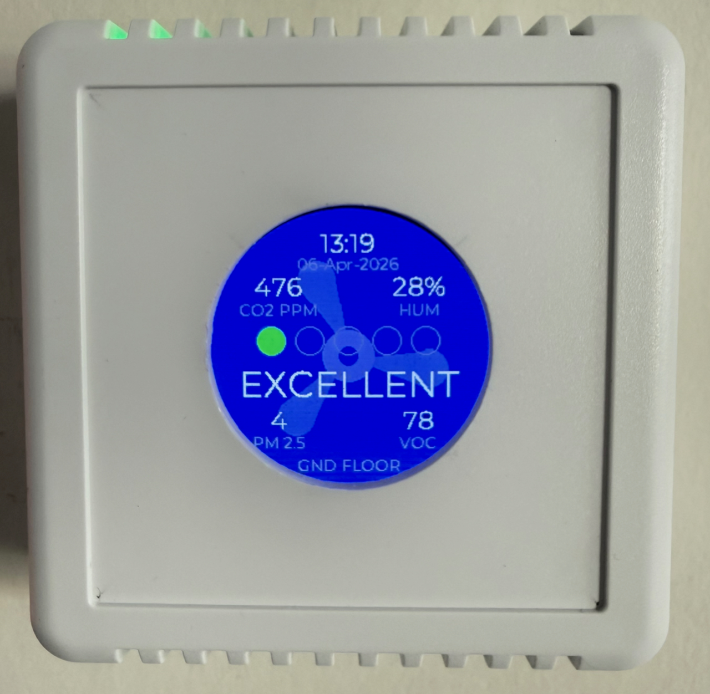
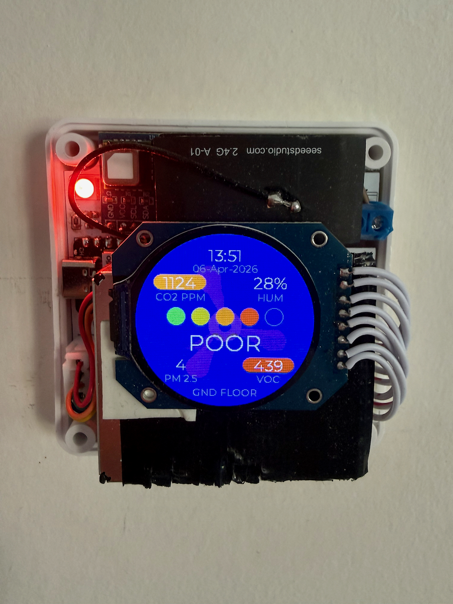

# AirSensor

A multi-room air quality monitor built around ESPHome and Home Assistant. Each unit sits flush on the wall like a light switch — mains powered, fully self-contained, nothing to charge or manage. Built on the ESP32-C6, it is hardware-ready for Matter, making it future-proof as smart home standards evolve.



---

## What it measures

Each unit reports the following to Home Assistant in real time:

| Sensor | Measurements |
|--------|-------------|
| **Sensirion SEN55** | PM1.0, PM2.5, PM4.0, PM10 · VOC Index · NOx Index · Temperature · Humidity |
| **Sensirion SCD4x** | CO2 (ppm) · Temperature · Humidity |
| **Infineon DPS310** *(optional)* | Barometric pressure · Temperature |

The DPS310 pressure sensor is fitted on one unit only and is entirely optional — the PCB and firmware support it but work fine without it.

---

## Display

Each unit has a **GC9A01A 240×240 round TFT** (SPI), sourced from AliExpress:


The display shows:
- **Time and date** (synced from Home Assistant)
- **CO2, humidity, PM2.5, VOC** values in the four quadrants
- A **5-segment AQI bar** reflecting the worst pollutant level across all sensors, colour-coded from green (Excellent) to red (Very Poor)
- A large **status word** (EXCELLENT / GOOD / FAIR / POOR / VERY POOR) at the centre
- An **animated fan graphic** as the background (see below)

The XIAO's built-in RGB LED *(optional)* breathes in the AQI colour — green through red depending on air quality — visible from across the room without looking at the display. It can be enabled or disabled from Home Assistant and the state persists across reboots.

---

## Animated fan

A **Fan Speed** entity (Off / Low / High) is exposed in Home Assistant. Selecting Low or High drives an animated three-blade fan spinning in the background of the display — slow and blue-purple at Low, faster and brighter purple at High. It is purely decorative and does not control any physical hardware. The selected speed persists across reboots.

---

## Hardware

| Component | Role |
|-----------|------|
| Seeed XIAO ESP32-C3 | MCU — different GPIO layout, otherwise identical firmware |
| Seeed XIAO ESP32-C6 | MCU — preferred variant; Wi-Fi 6, Matter-capable radio |
| Sensirion SEN55 | Particulate matter + VOC + NOx + T/RH |
| Sensirion SCD4x | CO2 + T/RH |
| Infineon DPS310 breakout | Barometric pressure *(optional)* |
| GC9A01A 240×240 round TFT | Round display (AliExpress) |
| Kradex Z123_W | Enclosure — standard wall-mount junction box |

The ESP32-C6 is the preferred variant. Its Wi-Fi 6 and IEEE 802.15.4 radio make it hardware-ready for Matter once ESPHome's Matter support matures. The C3 lacks the necessary radio and cannot support Matter.

---

## PCB

A single custom PCB designed in KiCad houses the MCU, sensors, and display connector inside the Kradex enclosure.




Custom KiCad libraries (symbols, footprints, and 3D models) are kept under `lib/` and referenced with portable `${KIPRJMOD}`-relative paths so the project opens correctly on any machine.

---

## Home Assistant integration

Each unit exposes the following entities:

- **Sensors** — all measured values listed above
- **Fan Speed** — select (Off / Low / High) to control the display animation
- **Status LED** — switch to enable or disable the breathing LED
- **Display Backlight** — light entity with brightness control
- **Restart** — button to reboot the device OTA

---

## MCU variants

| | ESP32-C3 | ESP32-C6 |
|-|----------|----------|
| Wi-Fi | 802.11 b/g/n | 802.11 b/g/n/ax (Wi-Fi 6) |
| BLE | 5.0 | 5.3 |
| Matter (future) | No — hardware limitation | Yes — IEEE 802.15.4 radio |
| GPIO | Different pinout | Reference pinout |

Two reference templates are provided — `ESPHome_config/AirSensor-C3.yaml` and `AirSensor-C6.yaml` — covering both variants. Real deployment configs live in `ESPHome_config/private/` (gitignored).

---

## Repository structure

```
AirSensor/
├── ESPHome_config/
│   ├── AirSensor-C3.yaml          # Reference template (ESP32-C3)
│   ├── AirSensor-C6.yaml          # Reference template (ESP32-C6)
│   ├── airsensor_aqi_helpers.h    # Shared AQI logic (C++)
│   ├── secrets.yaml               # Empty secrets template
│   └── private/                   # Real deployment configs (gitignored)
├── kicad/
│   └── AirSensor_display/         # KiCad project (schematic + PCB)
├── lib/
│   ├── symbols/                   # Custom KiCad symbols
│   ├── footprints/                # Custom KiCad footprints
│   └── 3d/                        # 3D models for KiCad
├── mech/                          # Enclosure and module STEP files
└── docs/
    └── Data sheets/               # Component datasheets
```

---

## Getting started

1. Copy `ESPHome_config/AirSensor-C3.yaml` or `AirSensor-C6.yaml` to `ESPHome_config/private/<unit-name>.yaml`
2. Fill in `ESPHome_config/private/secrets.yaml` (Wi-Fi credentials, API key, OTA password)
3. Search for `← CONFIGURE` markers in the YAML and update each one (device name, floor label, etc.)
4. Remove the DPS310 sensor block if the pressure sensor is not fitted
5. Flash via ESPHome: `esphome run private/<unit-name>.yaml`
